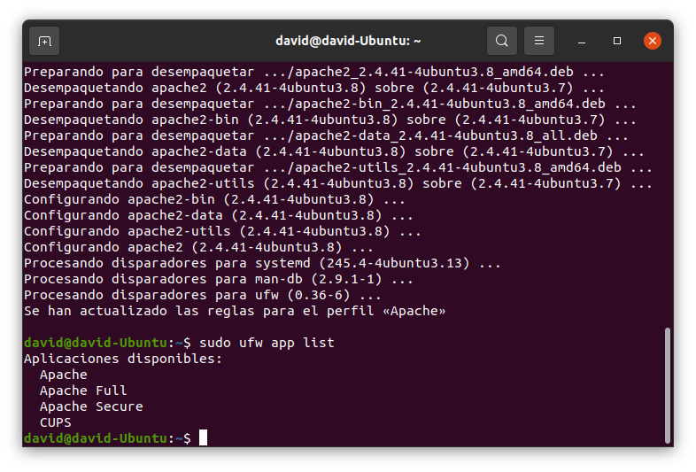
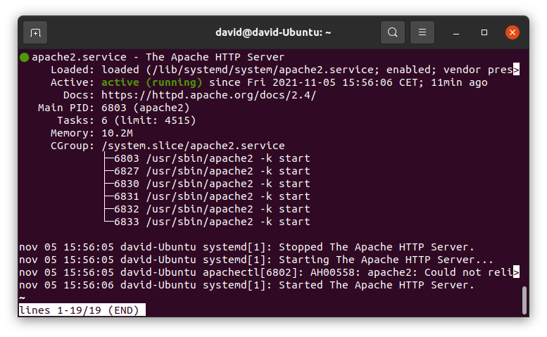
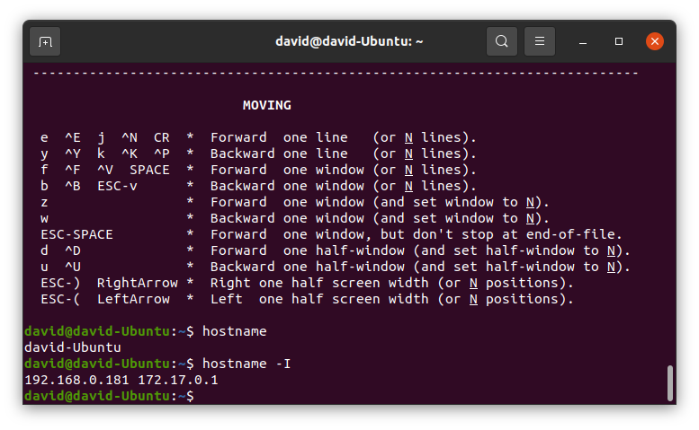
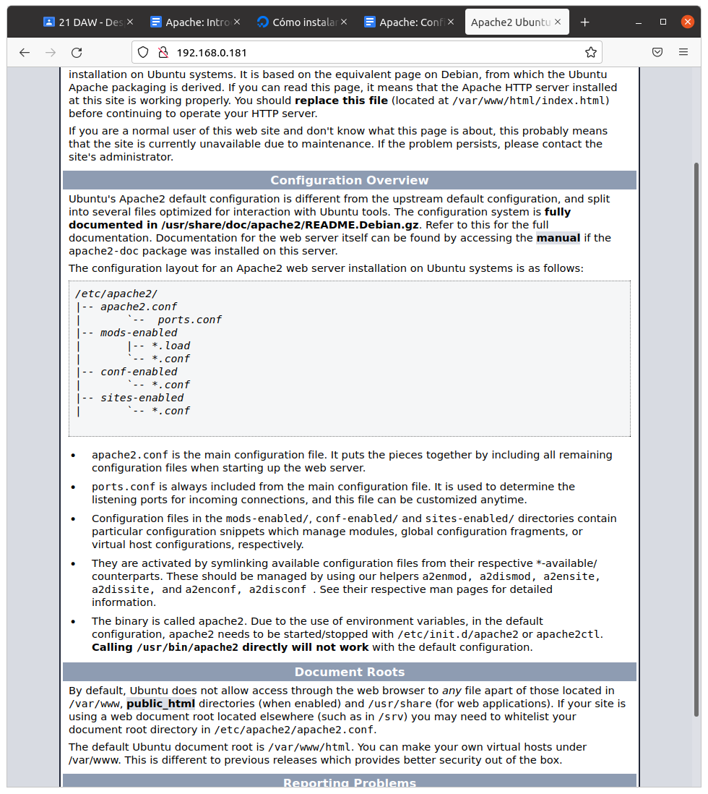
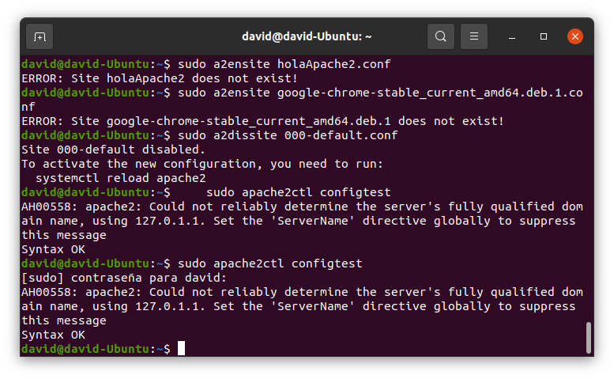

# Introducción Apache #
- Buenas aqui teneis un pequeño tuturial de como instalar apache en su servidor ubuntu.
- Primero tenemos que tener permisos non-root.
## Instalacion ##
- Primero utilizaremos esta instruccion para actualizar el indice de paquetes locales y reflejen los ultimos cambios.
~~~
sudo apt update
~~~
- Ahora instalamos apache2.
~~~
sudo apt install apache2
~~~

## Siguiente paso ##
- Antes de probar apache vamos a modificar los ajustes de firewall para dar acceso a los puertos web externos predeterminados.
- Escribimos lo siguiente.
~~~
sudo ufw app list
~~~
- Te saldra esta lista.

- Saldra 3 perfiles 
- Ahora permitiremos el trafico por el puerto 80
~~~
sudo ufw allow 'Apache'
~~~
- Comprobamos el cambio con:
~~~
sudo ufw status
~~~
## 3 paso ##
- Ahora ya deberiamos tener activo apache2, realizamos una verificación para saber que se encuentra en ejecuciòn.
~~~
sudo systemctl status apache2
~~~

- Con este comando nos dara una direccion web podemos probar en el navegador.
~~~
hostname -I
~~~

- 

# Parte 2 administracion Apache
- Ahora que tenemos listo el servidor vamos a ver algunos comandos de administracción
- Para detener el servidor.
~~~
sudo systemctl stop apache2
~~~
- Para iniciar el servidor.
~~~
sudo systemctl start apache2
~~~
- Para detener y iniciar el servicio de nuevo 
~~~
sudo systemctl restart apache2
~~~
- Si solo hacemos cambios de configuración podemos recargar sin cerrar conecxiones.
~~~
sudo systemctl reload apache2
~~~
- Por norma general apache se inicia cuando se arranca el servidor si no lo queremos asi podemos deshabilitar esto.
~~~
sudo systemctl disable apache2
~~~
- Para volver habilitar el sevicio escribimos lo siguiente.
~~~
sudo systemctl enable apache2
~~~
## Ahora configuramos el host virtual ##
- Creamos el directorio 
~~~
sudo mkdir /var/www/pruebaApache2
~~~
- A continuación asignamos la propiedad del directorio con la variable de entorno `user`
~~~
sudo chown -R $USER:$USER /var/www/pruebaApache2
~~~
- Para asegurarse de que sus permisos sean correctos y permitir al propietario leer, escribir y ejecutar los archivos, y a la vez conceder solo permisos de lectura y ejecución a los grupos y terceros, puede ingresar el siguiente comando:
~~~
sudo chmod -R 755 /var/www/pruebaApache2
~~~
- A continuación, cree una página de ejemplo index.html utilizando nano o su editor favorito:
- Agregamos el siguiente ejemplo html.
~~~
html>
    <head>
        <title>bien venido</title>
    </head>
    <body>
        <h1>Vemos si funciona bien todo</h1>
    </body>
</html>
~~~
- Para que apache muestre el contenido en vez de modificar el archivo lo cambiamos directamente.
~~~
sudo nano /etc/apache2/sites-available/pruebaApache2.conf
~~~
- Habilitamos el archivo
~~~
sudo a2ensite holaApache2.conf
~~~
- Ahora desabilitamos el sitio predeterminado
~~~
sudo a2dissite 000-default.conf
~~~
- Acontinuaión realizamos la prueba para ver que no hay errores.
~~~
sudo apache2ctl configtest
~~~

- Y por ultimo reniciamos apache para actualizar los cambios.
~~~
sudo systemctl restart apache2
~~~